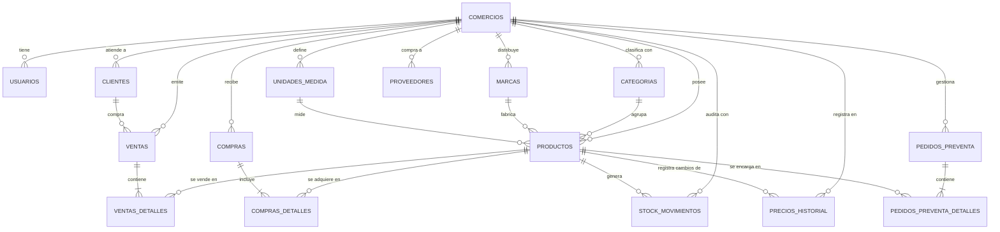

# Diccionario de Base de Datos y Modelo Relacional
## NegoStock SaaS - Control de Stock & Ferretería

Este documento técnico describe en detalle la arquitectura relacional de la base de datos en **PostgreSQL / Supabase**, con todos sus nombres de tablas y campos estandarizados en **Español**, sus tipos de datos, restricciones de integridad, triggers, funciones transaccionales y políticas de seguridad *Row Level Security* (RLS).

---

## 1. Diagrama Entidad-Relación (Mermaid ERD)

---

## 2. Catálogo de Tablas y Diccionario de Campos

### 2.1. Tabla: `comercios` (Multi-Inquilino / SaaS)
Almacena cada negocio o ferretería cliente suscripta a la plataforma.

| Campo | Tipo | Restricción | Descripción |
| :--- | :--- | :--- | :--- |
| `id` | `SERIAL` | **PK** | Identificador entero único del comercio (1, 2, 3...). |
| `nombre` | `TEXT` | NOT NULL | Nombre comercial o de fantasía (ej. "Ferretería Central"). |
| `razon_social` | `TEXT` | NULL | Denominación legal ante el fisco. |
| `cuit` | `TEXT` | NULL | CUIT tributario (Argentina: ej. 30-71234567-9). |
| `iibb` | `TEXT` | NULL | Número de Ingresos Brutos. |
| `condicion_iva` | `TEXT` | DEFAULT 'RESPONSABLE_INSCRIPTO' | Condición tributaria del comercio. |
| `direccion` | `TEXT` | NULL | Domicilio del local comercial. |
| `telefono` | `TEXT` | NULL | Teléfono de contacto. |
| `email` | `TEXT` | NULL | Correo electrónico principal. |
| `logo_url` | `TEXT` | NULL | URL del logotipo para impresión de tickets. |
| `esta_activo` | `BOOLEAN` | DEFAULT true | Estado de la suscripción del comercio. |
| `creado_en` | `TIMESTAMPTZ`| DEFAULT NOW() | Fecha y hora de alta en el sistema. |
| `actualizado_en` | `TIMESTAMPTZ`| DEFAULT NOW() | Última modificación de datos. |

---

### 2.2. Tabla: `usuarios` (Personal y Permisos RBAC)
Vincula a los empleados y usuarios de Supabase Auth con su comercio y rol.

| Campo | Tipo | Restricción | Descripción |
| :--- | :--- | :--- | :--- |
| `id` | `UUID` | **PK**, FK `auth.users(id)` | ID de autenticación en Supabase. |
| `comercio_id` | `INT` | **FK** `comercios(id)` | Comercio al que pertenece el empleado. |
| `nombre_completo` | `TEXT` | NOT NULL | Nombre y apellido del usuario. |
| `rol` | `TEXT` | CHECK in (`ADMIN`, `MANAGER`, `CASHIER`, `SELLER`) | Nivel de permisos asignado. |
| `codigo_pin` | `TEXT` | DEFAULT '1111' | PIN de 4 dígitos para cambio rápido en mostrador. |
| `esta_activo` | `BOOLEAN` | DEFAULT true | Si el empleado está habilitado para operar. |
| `creado_en` | `TIMESTAMPTZ`| DEFAULT NOW() | Fecha de creación. |

---

### 2.3. Tabla: `productos` (Catálogo y Stock)
Artículos e insumos de la ferretería.

| Campo | Tipo | Restricción | Descripción |
| :--- | :--- | :--- | :--- |
| `id` | `UUID` | **PK**, DEFAULT uuid_generate_v4() | Identificador global del producto. |
| `comercio_id` | `INT` | **FK** `comercios(id)` | Comercio propietario del producto. |
| `codigo_sku` | `TEXT` | NOT NULL, UNIQUE con `comercio_id` | Código interno (ej. `2030`, `8034`). |
| `codigo_barras` | `TEXT` | NULL | Código de barras comercial EAN-13. |
| `nombre` | `TEXT` | NOT NULL | Descripción comercial del artículo. |
| `descripcion` | `TEXT` | NULL | Especificaciones técnicas o medidas. |
| `categoria_id` | `UUID` | **FK** `categorias(id)` | Rubro (Herramientas, Electricidad, etc.). |
| `marca_id` | `UUID` | **FK** `marcas(id)` | Marca comercial (MOTA, SICA, TACSA, etc.). |
| `unidad_id` | `UUID` | **FK** `unidades_medida(id)` | Unidad (u, m, kg, rollo, bolsa). |
| `precio_costo` | `NUMERIC(14, 2)` | NOT NULL DEFAULT 0.00 | Costo de reposición según proveedor. |
| `margen_ganancia` | `NUMERIC(6, 2)` | DEFAULT 100.00 | Margen proyectado en porcentaje %. |
| `precio_venta` | `NUMERIC(14, 2)` | NOT NULL DEFAULT 0.00 | Precio lista mostrador (minorista). |
| `precio_mayoreo` | `NUMERIC(14, 2)` | DEFAULT 0.00 | Precio especial para gremio u obra. |
| `alicuota_iva` | `NUMERIC(5, 2)` | DEFAULT 21.00 | Tasa de IVA (21%, 10.5%, 0%). |
| `stock_actual` | `NUMERIC(12, 4)` | NOT NULL DEFAULT 0.0000 | Stock físico consolidado (soporta decimales). |
| `stock_minimo` | `NUMERIC(12, 4)` | NOT NULL DEFAULT 0.0000 | Nivel de alerta para reposición. |
| `stock_maximo` | `NUMERIC(12, 4)` | NULL | Capacidad máxima sugerida de almacenamiento. |
| `permite_stock_negativo` | `BOOLEAN`| DEFAULT false | Si permite despachar sin stock cargado. |
| `esta_activo` | `BOOLEAN` | DEFAULT true | Visibilidad en catálogo de mostrador. |
| `creado_en` | `TIMESTAMPTZ`| DEFAULT NOW() | Fecha de alta. |
| `actualizado_en` | `TIMESTAMPTZ`| DEFAULT NOW() | Fecha de última modificación de precio/stock. |

---

### 2.4. Tabla: `ventas` (Cabecera de Comprobantes)
Registro de ventas cobradas y comprobantes de mostrador.

| Campo | Tipo | Restricción | Descripción |
| :--- | :--- | :--- | :--- |
| `id` | `UUID` | **PK**, DEFAULT uuid_generate_v4() | ID único de la venta. |
| `comercio_id` | `INT` | **FK** `comercios(id)` | Comercio emisor. |
| `cliente_id` | `UUID` | **FK** `clientes(id)` | Cliente asociado (Consumidor Final o cuenta). |
| `tipo_comprobante` | `TEXT` | CHECK in (`TICKET_X`, `PRESUPUESTO`, `REMITO`, `FACTURA_A`, `FACTURA_B`, `FACTURA_C`) | Tipo de comprobante. |
| `punto_venta` | `INTEGER` | NOT NULL DEFAULT 1 | Número de puesto/punto de venta (ej. 1). |
| `numero_secuencia` | `INTEGER` | NOT NULL | Número correlativo generado sin huecos. |
| `numero_comprobante` | `TEXT` | NOT NULL | Formato formal (ej. `0001-00000142`). |
| `estado` | `TEXT` | CHECK in (`PENDIENTE`, `PAGADA`, `ANULADA`) | Estado del comprobante. |
| `medio_pago` | `TEXT` | CHECK in (`EFECTIVO`, `TRANSFERENCIA`, `DEBITO`, `CREDITO`, `MERCADOPAGO`, `CTA_CTE`, `MIXTO`) | Forma de cobro. |
| `modalidad_precio` | `TEXT` | CHECK in (`selling`, `wholesale`) | Lista aplicada (Minorista o Mayorista). |
| `subtotal` | `NUMERIC(14, 2)` | NOT NULL DEFAULT 0.00 | Suma bruta de ítems. |
| `descuento` | `NUMERIC(14, 2)` | NOT NULL DEFAULT 0.00 | Monto de bonificación aplicada. |
| `total_iva` | `NUMERIC(14, 2)` | NOT NULL DEFAULT 0.00 | IVA discriminado o contenido. |
| `total` | `NUMERIC(14, 2)` | NOT NULL DEFAULT 0.00 | Importe final cobrado. |
| `id_offline_cliente` | `TEXT` | NULL | ID generado en modo desconectado para evitar duplicados. |
| `notas` | `TEXT` | NULL | Observaciones del mostrador. |
| `creado_en` | `TIMESTAMPTZ`| DEFAULT NOW() | Fecha y hora exacta de la venta. |

---

### 2.5. Tabla: `ventas_detalles` (Líneas de Comprobante)

| Campo | Tipo | Restricción | Descripción |
| :--- | :--- | :--- | :--- |
| `id` | `UUID` | **PK**, DEFAULT uuid_generate_v4() | ID del renglón de venta. |
| `venta_id` | `UUID` | **FK** `ventas(id)` ON DELETE CASCADE | Venta a la que pertenece. |
| `producto_id` | `UUID` | **FK** `productos(id)` RESTRICT | Artículo vendido. |
| `cantidad` | `NUMERIC(12, 4)` | NOT NULL | Cantidad vendida (u, metros, kg). |
| `precio_unitario` | `NUMERIC(14, 2)` | NOT NULL | Precio de venta cobrado por unidad. |
| `precio_costo` | `NUMERIC(14, 2)` | NOT NULL | **Costo congelado al momento de la venta** (para auditoría de rentabilidad neta real). |
| `alicuota_iva` | `NUMERIC(5, 2)` | DEFAULT 21.00 | IVA del ítem. |
| `subtotal` | `NUMERIC(14, 2)` | NOT NULL | `cantidad * precio_unitario`. |

---

### 2.6. Tabla: `stock_movimientos` (Kardex de Inventario Inmutable)

| Campo | Tipo | Restricción | Descripción |
| :--- | :--- | :--- | :--- |
| `id` | `UUID` | **PK**, DEFAULT uuid_generate_v4() | ID del movimiento. |
| `comercio_id` | `INT` | **FK** `comercios(id)` | Comercio correspondiente. |
| `producto_id` | `UUID` | **FK** `productos(id)` ON DELETE CASCADE | Artículo afectado. |
| `tipo_movimiento` | `TEXT` | CHECK in (`VENTA`, `COMPRA`, `AJUSTE_POSITIVO`, `AJUSTE_NEGATIVO`, `ROTURA`, `INICIAL`) | Motivo del movimiento. |
| `cantidad` | `NUMERIC(12, 4)` | NOT NULL | Variación (+ entrada, - salida). |
| `saldo_posterior`| `NUMERIC(12, 4)` | NOT NULL | Stock resultante tras la operación. |
| `costo_unitario` | `NUMERIC(14, 2)` | NULL | Costo vigente al producirse el movimiento. |
| `referencia_id` | `UUID` | NULL | ID de la venta o compra vinculada. |
| `notas` | `TEXT` | NULL | Aclaración o motivo ingresado por el usuario. |
| `creado_en` | `TIMESTAMPTZ`| DEFAULT NOW() | Fecha y hora del asiento. |

---

### 2.7. Tabla: `precios_historial` (Auditoría de Precios e Inflación)

| Campo | Tipo | Restricción | Descripción |
| :--- | :--- | :--- | :--- |
| `id` | `UUID` | **PK**, DEFAULT uuid_generate_v4() | ID del registro histórico. |
| `comercio_id` | `INT` | **FK** `comercios(id)` | Comercio correspondiente. |
| `producto_id` | `UUID` | **FK** `productos(id)` ON DELETE CASCADE | Artículo modificado. |
| `costo_anterior` | `NUMERIC(14, 2)` | NOT NULL | Costo antes de la modificación. |
| `costo_nuevo` | `NUMERIC(14, 2)` | NOT NULL | Costo posterior a la modificación. |
| `venta_anterior` | `NUMERIC(14, 2)` | NOT NULL | Precio de venta antes del cambio. |
| `venta_nueva` | `NUMERIC(14, 2)` | NOT NULL | Precio de venta nuevo. |
| `mayoreo_anterior`| `NUMERIC(14, 2)` | DEFAULT 0.00 | Mayoreo previo. |
| `mayoreo_nuevo` | `NUMERIC(14, 2)` | DEFAULT 0.00 | Mayoreo nuevo. |
| `motivo_cambio` | `TEXT` | CHECK in (`MANUAL`, `AUMENTO_MASIVO`, `IMPORTACION_EXCEL`, `RECEPCION_COMPRA`) | Origen de la actualización. |
| `usuario_nombre` | `TEXT` | NULL | Nombre del usuario que ejecutó el cambio. |
| `creado_en` | `TIMESTAMPTZ`| DEFAULT NOW() | Fecha y hora del cambio de precio. |

---

### 2.8. Tabla: `pedidos_preventa` y `pedidos_preventa_detalles`
Gestiona el flujo de mostrador donde el vendedor arma el pedido y el cliente paga en caja central.

* **`pedidos_preventa`**: `id`, `comercio_id`, `numero_pedido` (ej. `PED-001`), `cliente_id`, `modalidad_precio`, `subtotal`, `descuento`, `total`, `estado` (`PENDIENTE`, `COBRADO`, `CANCELADO`), `notas`, `creado_en`.
* **`pedidos_preventa_detalles`**: `id`, `pedido_id`, `producto_id`, `cantidad`, `precio_unitario`, `subtotal`.

---

### 2.9. Tabla: `comprobantes_secuencias`
Asegura la numeración correlativa sin saltos ni duplicaciones ante cobros simultáneos.
* Clave Primaria Compuesta: `(comercio_id, punto_venta, tipo_comprobante)`.
* Columna: `ultimo_numero INT`.

---

## 3. Funciones Almacenadas (RPC) y Triggers

### 3.1. `procesar_venta_mostrador(...)`
Función transaccional atómica que encapsula todo el ciclo de venta en mostrador:
1. **Verificación de Idempotencia:** Si recibe `p_offline_id` ya procesado, devuelve la venta previa sin duplicar datos.
2. **Generación de Número Correlativo:** Incrementa `ultimo_numero` en `comprobantes_secuencias` mediante bloqueo `FOR UPDATE`.
3. **Bloqueo y Descuento de Stock:** Ejecuta `SELECT ... FOR UPDATE` sobre cada producto vendido, calcula subtotales, descuenta `stock_actual` e inserta en `stock_movimientos` (Kardex).
4. **Inserción de Venta y Detalle:** Inserta en `ventas` y `ventas_detalles` congelando el costo del momento.
5. **Cuenta Corriente:** Si el pago es `CTA_CTE`, descuenta del saldo del cliente.

### 3.2. `actualizar_precios_masivo(...)`
Ajusta masivamente listas de precios por rubro o marca según porcentaje, criterio (venta, costo+margen, costo) y redondeo a múltiplos de $10, $50 o $100.

### 3.3. Triggers Automáticos
* **`trg_despues_cambio_precio_producto`**: Dispara `trg_registrar_historial_precio()` tras cualquier `UPDATE` en precios de la tabla `productos` para alimentar `precios_historial`.
* **`en_auth_usuario_creado`**: Dispara `manejar_nuevo_usuario()` para crear automáticamente el registro en la tabla `usuarios` al registrarse en Supabase Auth.

---

## 4. Políticas de Seguridad (Row Level Security - RLS)

Cada consulta y mutación en Supabase se valida con el motor RLS de PostgreSQL:
* **`obtener_comercio_id_autenticado()`**: Retorna el `comercio_id` asociado al usuario en sesión.
* **`obtener_rol_autenticado()`**: Retorna el rol del usuario (`ADMIN`, `MANAGER`, `CASHIER`, `SELLER`).
* **Aislamiento Multi-inquilino:** Todas las tablas filtran `WHERE comercio_id = obtener_comercio_id_autenticado()`.
* **Protección de Datos Sensibles:** Los cajeros y vendedores tienen permiso `SELECT` limitado y no pueden modificar el catálogo ni ver márgenes brutos.
