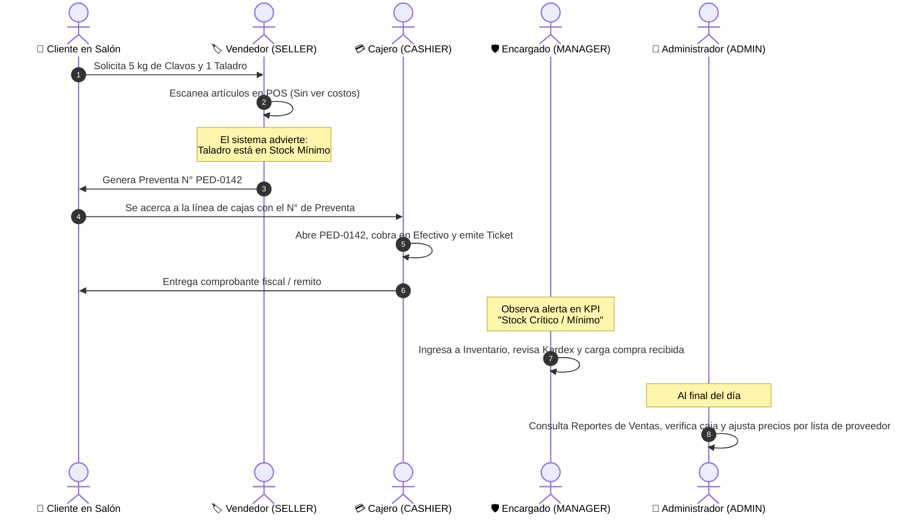

# Matriz de Perfiles, Roles y Permisos (RBAC)
## Sistema NegoStock SaaS - Control de Accesos y Privilegios en el Comercio

Este documento detalla de manera exhaustiva la estructura de **seguridad basada en roles (RBAC - Role-Based Access Control)** implementada en NegoStock. Establece qué funciones, pantallas, datos financieros y acciones operativas tiene permitidas y restringidas cada perfil de usuario en el local.

---

## 1. Resumen de Perfiles del Sistema

NegoStock cuenta con **cinco (5) perfiles jerárquicos**, diseñados específicamente para responder a la realidad organizativa de una ferretería, bulonera, corralón o comercio minorista:

```
┌────────────────────────────────────────────────────────┐
│  👑 SUPERADMIN: Desarrollador / Licenciatario SaaS     │
└───────────────────────────┬────────────────────────────┘
                            │
┌───────────────────────────▼────────────────────────────┐
│  👤 ADMIN: Dueño / Administrador General del Negocio   │
└───────────────────────────┬────────────────────────────┘
                            │
┌───────────────────────────▼────────────────────────────┐
│  🛡️ MANAGER: Encargado de Local / Jefe de Depósito     │
└─────────────┬────────────────────────────┬─────────────┘
              │                            │
┌─────────────▼──────────────┐ ┌───────────▼─────────────┐
│ 💳 CASHIER: Cajero / Cobro │ │ 🏷️ SELLER: Vendedor     │
└────────────────────────────┘ └─────────────────────────┘
```

---

## 2. Detalle Individual por Perfil

### 2.1 👑 SUPERADMIN (Superusuario / SaaS Master / Desarrollador)
* **Destinatario:** Desarrollador de software, soporte técnico e ingeniería del SaaS.
* **Propósito:** Control de infraestructura, activación de licencias modulares, diagnóstico del sistema, copias de seguridad de bajo nivel y soporte de contingencia.
* **Identificación Visual:** Badge Violeta Oscuro (`deep-purple-accent-4`), Icono Corona (`mdi-crown`).
* **Credenciales de Fábrica:**
  - Correo: `superadmin@negostock.com` | Clave: `superadmin123`
  - PIN Mostrador: **`9999`**
* **Privilegios Clave (Qué PUEDE hacer):**
  - ✅ Habilitar o deshabilitar módulos del sistema (licenciamiento según el abono contratado por el cliente).
  - ✅ Descargar copias de seguridad íntegras (`.json` / `.sql`) de todas las tablas y restaurar puntos de inicio.
  - ✅ Acceso total a todas las funciones del Administrador, Encargado, Cajero y Vendedor.
  - ✅ Inspeccionar anomalías y logs de integridad del sistema.
* **Seguridad y Blindaje Especial:**
  - 🔒 **Invisibilidad:** El Superusuario nunca aparece listado en la pantalla de gestión de personal (`/usuarios`) para los administradores o empleados locales, impidiendo ediciones o borrados accidentales de la cuenta de soporte.
  - 🔒 **Protección de PIN:** Su PIN maestro (`9999`) no puede ser consultado ni sobrescrito por operadores del comercio.

---

### 2.2 👤 ADMIN (Administrador / Dueño del Comercio)
* **Destinatario:** Propietario del negocio, socio gerente o administrador general.
* **Propósito:** Toma de decisiones estratégicas, definición de márgenes de ganancia, aumentos de precios por inflación, control de costos, análisis de rentabilidad y gestión del personal.
* **Identificación Visual:** Badge Púrpura (`purple-darken-2`), Icono Escudo con Corona (`mdi-shield-crown`).
* **Credenciales de Fábrica:**
  - Correo: `admin@ferreteria.com` (o `demo@negostock.com` en entorno de prueba)
  - Clave: `admin123` (`demo123`)
  - PIN Mostrador: **`1234`** (o **`0000`** en modo demo)
* **Privilegios Clave (Qué PUEDE hacer):**
  - ✅ **Visualización de Costos y Márgenes:** Ve el costo de compra de cada artículo, el margen de utilidad y la valuación patrimonial del inventario al costo.
  - ✅ **Actualización Masiva por Inflación:** Aplica aumentos porcentuales a rubros o marcas enteras con redondeo para efectivo.
  - ✅ **Importación y Exportación Masiva:** Puede vaciar tablas para arrancar en limpio (`VACIAR`), importar archivos Excel/CSV de proveedores y exportar catálogos.
  - ✅ **Reportes Ejecutivos y Facturación:** Acceso irrestricto al informe de ventas por día, horas pico, ventas por mes, canales de pago y ranking de empleados.
  - ✅ **Gestión de Personal:** Crea, modifica o desactiva cajeros, vendedores y encargados, asignándoles sus nombres y PINs.
  - ✅ **Configuración del Negocio:** Modifica la razón social, CUIT, condición de IVA, domicilio, teléfono y pie de tickets.
  - ✅ **Gestión de Comprobantes:** Puede cobrar en caja, emitir presupuestos y anular ventas asentando el motivo de auditoría.
* **Restricciones de Seguridad (Qué NO puede hacer):**
  - ❌ No puede habilitar ni deshabilitar módulos del sistema (exclusivo Desarrollador / Superusuario).
  - ❌ No puede generar volcados de backup completos ni restaurar bases de datos globales (exclusivo Superusuario).
  - ❌ No puede visualizar ni editar al Superusuario en la lista de personal.

---

### 2.3 🛡️ MANAGER (Encargado de Local / Jefe de Depósito)
* **Destinatario:** Encargado de sucursal, capataz de depósito o jefe de salón.
* **Propósito:** Garantizar el abastecimiento, controlar el stock físico, recibir compras de proveedores y verificar diferencias de inventario.
* **Identificación Visual:** Badge Índigo (`indigo`), Icono Escudo con Persona (`mdi-shield-account`).
* **Credenciales de Fábrica:**
  - Correo: `encargado@ferreteria.com`
  - Clave: `encargado123`
  - PIN Mostrador: **`2222`**
* **Privilegios Clave (Qué PUEDE hacer):**
  - ✅ **Consulta de Costos:** Puede ver los precios de costo para chequear presupuestos de proveedores y recepcionar remitos de compra.
  - ✅ **Alta y Edición de Productos:** Crea artículos nuevos, modifica descripciones, unidades de medida y asigna códigos de barras.
  - ✅ **Ajustes de Stock y Kardex:** Realiza ajustes manuales de entrada/salida (rotura, vencimiento, compra, sobrante) asentando su firma de operador en el Kardex.
  - ✅ **Cobro y Facturación:** Puede operar el punto de venta (cobrar en caja si hay cola o cubrir turnos).
  - ✅ **Emisión de Presupuestos:** Genera presupuestos digitales y remitos para clientes de obra.
* **Restricciones de Seguridad (Qué NO puede hacer):**
  - ❌ **Sin Aumento Masivo de Precios:** No puede aplicar aumentos masivos automáticos por porcentaje.
  - ❌ **Sin Vaciado de Catálogo:** No tiene habilitado el botón para vaciar o reiniciar el inventario.
  - ❌ **Sin Reportes Ejecutivos de Ganancias:** No puede ver la facturación total mensual del comercio, los márgenes netos del dueño ni el ranking de ventas de sus compañeros.
  - ❌ **Sin Gestión de Personal:** No puede crear nuevos usuarios ni modificar los PINs de otros empleados.
  - ❌ **Sin Configuración Fiscal:** No puede alterar el CUIT, razón social ni datos del negocio.

---

### 2.4 💳 CASHIER (Cajero / Facturación de Mostrador)
* **Destinatario:** Operador de caja, cajero de turno o personal de cobranzas.
* **Propósito:** Cobro ágil de ventas en mostrador, emisión de tickets térmicos, recepción de dinero, registro de tarjetas/transferencias y apertura/cierre de turnos de caja.
* **Identificación Visual:** Badge Verde Azulado (`teal-darken-2`), Icono Caja Registradora (`mdi-cash-register`).
* **Credenciales de Fábrica:**
  - Correo: `caja@ferreteria.com`
  - Clave: `caja123`
  - PIN Mostrador: **`3333`**
* **Privilegios Clave (Qué PUEDE hacer):**
  - ✅ **Cobro en Mostrador:** Utiliza el Punto de Venta (`/pos`), aplica medios de pago (Efectivo, Débito, Crédito, Transferencia, QR Mercado Pago, Cuenta Corriente) y calcula vueltos.
  - ✅ **Cobro de Preventas:** Recupera carritos o presupuestos armados por los vendedores de salón (`PED-XXX`) para cobrarlos en caja.
  - ✅ **Emisión de Comprobantes:** Imprime tickets térmicos en 80mm / 58mm y remitos de entrega.
  - ✅ **Búsqueda de Catálogo y Consulta de Stock:** Busca artículos por nombre, código de barras o SKU para informar precios al cliente.
  - ✅ **Gestión de Clientes:** Da de alta clientes en el momento del cobro y consulta sus saldos de cuenta corriente.
* **Restricciones de Seguridad (Qué NO puede hacer):**
  - ❌ **COSTOS DE COMPRA TOTALMENTE OCULTOS:** En toda la interfaz de caja e inventario, las columnas de *Precio Costo* y *Valuación al Costo* están invisibilizadas por completo. Solo ve precios finales de venta.
  - ❌ **No puede modificar precios:** No puede cambiar los precios unitarios de venta fijados por la administración.
  - ❌ **No puede ajustar stock en Kardex:** No puede alterar las cantidades físicas sin que medie una venta formal.
  - ❌ **No puede ver reportes de ganancias:** No accede a la pestaña de reportes ejecutivos ni a la facturación global del comercio.
  - ❌ **No puede anular comprobantes:** La anulación de ventas requiere autorización de Encargado o Administrador para evitar fraudes en caja.

---

### 2.5 🏷️ SELLER (Vendedor de Salón / Preventa de Mostrador)
* **Destinatario:** Vendedor de mostrador, asesor de pasillo o personal de atención telefónica/WhatsApp.
* **Propósito:** Asesorar al cliente, verificar disponibilidad de mercadería, escanear productos y armar el pedido de preventa o cotización.
* **Identificación Visual:** Badge Azul Grisáceo (`blue-grey`), Icono Mostrador (`mdi-storefront`).
* **Credenciales de Fábrica:**
  - Correo: `carlos@ferreteria.com`
  - Clave: `carlos123`
  - PIN Mostrador: **`4444`**
* **Privilegios Clave (Qué PUEDE hacer):**
  - ✅ **Armado de Carritos y Preventas:** Agrega artículos al changuito, selecciona cantidades y genera la orden de compra (`PED-XXX`).
  - ✅ **Generación de Presupuestos:** Arma cotizaciones para clientes con validez temporal y las imprime o descarga en PDF.
  - ✅ **Consulta de Catálogo y Ubicación:** Revisa existencias en tiempo real de artículos para responder al cliente.
  - ✅ **Alerta de Stock Crítico:** El sistema le advierte en pantalla si un artículo solicitado tiene stock menor o igual al mínimo.
* **Restricciones de Seguridad (Qué NO puede hacer):**
  - ❌ **NO PUEDE COBRAR NI FINALIZAR VENTAS:** No tiene acceso al botón final de cobro (`COBRAR [F2]`). Solo puede presionar *"Generar Preventa"* para que el cliente pase por la línea de cajas.
  - ❌ **COSTOS Y MÁRGENES ESTRICTAMENTE OCULTOS:** No ve costos de reposición ni márgenes de ganancia.
  - ❌ **No puede modificar precios ni dar de alta artículos.**
  - ❌ **No puede ajustar el stock ni acceder a reportes o configuración.**

---

## 3. Matriz Comparativa de Funcionalidades por Perfil

| Funcionalidad / Módulo del Sistema | 👑 SUPERADMIN | 👤 ADMIN | 🛡️ MANAGER | 💳 CASHIER | 🏷️ SELLER |
| :--- | :---: | :---: | :---: | :---: | :---: |
| **Ver Precios de Costo y Margen %** | ✅ Sí | ✅ Sí | ✅ Sí | ❌ No | ❌ No |
| **Ver Valuación Total de Inventario** | ✅ Sí | ✅ Sí | ✅ Sí | ❌ No | ❌ No |
| **Consultar Precios de Venta al Público**| ✅ Sí | ✅ Sí | ✅ Sí | ✅ Sí | ✅ Sí |
| **Crear y Modificar Artículos Individuales**| ✅ Sí | ✅ Sí | ✅ Sí | ❌ No | ❌ No |
| **Pausar / Activar Artículos (Sin Borrado)**| ✅ Sí | ✅ Sí | ✅ Sí | ❌ No | ❌ No |
| **Ajustar Stock Manualmente (Kardex)** | ✅ Sí | ✅ Sí | ✅ Sí | ❌ No | ❌ No |
| **Ver Historial de Precios y Kardex** | ✅ Sí | ✅ Sí | ✅ Sí | ❌ No | ❌ No |
| **Armar Preventa / Carrito de Salón** | ✅ Sí | ✅ Sí | ✅ Sí | ✅ Sí | ✅ Sí |
| **Cobrar en Caja y Emitir Ticket** | ✅ Sí | ✅ Sí | ✅ Sí | ✅ Sí | ❌ No |
| **Armar y Descargar Presupuestos PDF**| ✅ Sí | ✅ Sí | ✅ Sí | ✅ Sí | ✅ Sí |
| **Consultar Historial de Ventas** | ✅ Sí | ✅ Sí | ✅ Sí | ✅ Sí (Turno) | ❌ No |
| **Reimprimir Tickets y Remitos** | ✅ Sí | ✅ Sí | ✅ Sí | ✅ Sí | ❌ No |
| **Anular Comprobante de Venta** | ✅ Sí | ✅ Sí | ✅ Sí | ❌ No | ❌ No |
| **Aumento Masivo de Precios (%)** | ✅ Sí | ✅ Sí | ❌ No | ❌ No | ❌ No |
| **Importar Catálogo desde Excel/CSV** | ✅ Sí | ✅ Sí | ❌ No | ❌ No | ❌ No |
| **Exportar Catálogo Completo a Excel**| ✅ Sí | ✅ Sí | ✅ Sí | ❌ No | ❌ No |
| **Vaciar Tablas e Iniciar Catálogo** | ✅ Sí | ✅ Sí | ❌ No | ❌ No | ❌ No |
| **Reportes Ejecutivos de Ventas** | ✅ Sí | ✅ Sí | ❌ No | ❌ No | ❌ No |
| **Análisis de Horas Pico y Rentabilidad**| ✅ Sí | ✅ Sí | ❌ No | ❌ No | ❌ No |
| **Dar de Alta y Modificar Clientes** | ✅ Sí | ✅ Sí | ✅ Sí | ✅ Sí | ❌ No |
| **Crear Empleados y Cambiar PINs** | ✅ Sí | ✅ Sí | ❌ No | ❌ No | ❌ No |
| **Configurar Datos del Negocio (CUIT)** | ✅ Sí | ✅ Sí | ❌ No | ❌ No | ❌ No |
| **Habilitar / Deshabilitar Módulos SaaS**| ✅ Sí | ❌ No | ❌ No | ❌ No | ❌ No |
| **Generar y Restaurar Backups Globales**| ✅ Sí | ❌ No | ❌ No | ❌ No | ❌ No |

---

## 4. Dinámica Operativa Diaria en el Comercio

A continuación se ilustra el flujo de trabajo estándar en mostrador coordinando los distintos roles:



---

## 5. Políticas de Seguridad de la Sesión y PINs

1. **Autenticación Rápida con PIN:**
   Los mostradores de atención al público operan mediante PIN táctil de 4 dígitos. Cada empleado posee un código individual intransferible.
2. **Prohibición de Cambio de Usuario al Vuelo:**
   Por estrictas razones de auditoría contable y responsabilidad de caja, el sistema no permite alternar usuarios sin cerrar la sesión previa. Para que otro empleado use la terminal, el operador anterior debe pulsar **"Salir"**.
3. **Cierre Automático por Inactividad (Timeout):**
   Si una terminal queda sin uso por el tiempo estipulado en la configuración (ej. 15 minutos), la pantalla se bloquea automáticamente requiriendo el reingreso del PIN para proteger la información del negocio.
4. **Firma de Operador en Auditoría:**
   Cada venta cobrada, anulación, cambio de precio o ajuste de stock en Kardex guarda de forma inmutable el **Nombre, Rol y Hora** del operador que ejecutó la acción.

---
*Documento de especificación técnica y operativa de NegoStock SaaS. Versión 1.0 - Octubre 2026.*
